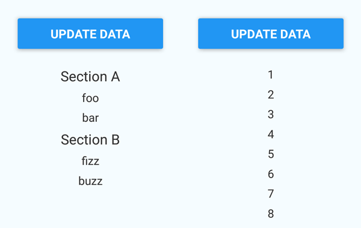

# React Native Immutable ListView

[](https://travis-ci.org/cooperka/react-native-immutable-list-view)
[](https://www.npmjs.com/package/react-native-immutable-list-view)
[](https://www.npmjs.com/package/react-native-immutable-list-view)
[](https://github.com/cooperka/react-native-immutable-list-view)

<br>

[](#README)

<br>

A drop-in replacement for React Native's [`ListView`](https://facebook.github.io/react-native/docs/listview.html),
[`FlatList`](https://facebook.github.io/react-native/docs/flatlist.html),
and [`VirtualizedList`](https://facebook.github.io/react-native/docs/virtualizedlist.html).



It supports [Immutable.js](https://facebook.github.io/immutable-js/) to give you faster performance and less headaches.

## Motivation

- Do you use Immutable data, only to write the same boilerplate over and over in order to display it?
- Do you want to show 'Loading...', 'No results', and 'Error!' states in your lists?
- Do you have nested objects in your state so a shallow diff won't cut it for pure rendering?
- Do you want better performance while animating screen transitions?

If you answered yes to ANY of these questions, this project can help. Check out the examples below.

## How it works

For FlatList and VirtualizedList:

```jsx
<ImmutableVirtualizedList
  immutableData={this.state.listData}
  renderItem={this.renderItem}
/>
```

For ListView:

```jsx
<ImmutableListView
  immutableData={this.state.listData}
  renderRow={this.renderRow}
/>
```

The screenshot above shows two different lists. The first uses this data:

```js
Immutable.fromJS({
  'Section A': [
    'foo',
    'bar',
  ],
  'Section B': [
    'fizz',
    'buzz',
  ],
})
```

The second list is even simpler:

```js
Immutable.Range(1, 100)
```

There's an example app [here](https://github.com/cooperka/react-native-immutable-list-view/tree/master/example)
if you'd like to see it in action.

## Installation

1. Install:
    - Using [npm](https://www.npmjs.com/#getting-started): `npm install react-native-immutable-list-view --save`
    - Using [Yarn](https://yarnpkg.com/): `yarn add react-native-immutable-list-view`

2. Import it in your JS:

    For FlatList and VirtualizedList:

    ```js
    import { ImmutableVirtualizedList } from 'react-native-immutable-list-view';
    ```

    For ListView:

    ```js
    import { ImmutableListView } from 'react-native-immutable-list-view';
    ```

## Example usage -- replacing FlatList

Goodbye, `keyExtractor` boilerplate!

> Note: This example diff looks much better on [GitHub](https://github.com/cooperka/react-native-immutable-list-view#example-usage----replacing-flatlist) than on npm's site.
> Red means delete, green means add.

```diff
-import { Text, View, FlatList } from 'react-native';
+import { Text, View } from 'react-native';
+import { ImmutableVirtualizedList } from 'react-native-immutable-list-view';

 import style from './styles';
 import listData from './listData';

 class App extends Component {

   renderItem({ item, index }) {
     return <Text style={style.row}>{item}</Text>;
   }

  render() {
    return (
      <View style={style.container}>
         <Text style={style.welcome}>
           Welcome to React Native!
         </Text>
-        <FlatList
-          data={listData}
-          getItem={(items, index) => items.get(index)}
-          getItemCount={(items) => items.size}
-          keyExtractor={(item, index) => String(index)}
+        <ImmutableVirtualizedList
+          immutableData={listData}
           renderItem={this.renderItem}
         />
      </View>
    );
  }

}
```

## Example usage -- replacing ListView

You can remove all that boilerplate in your constructor, as well as lifecycle methods like
`componentWillReceiveProps` if all they're doing is updating your `dataSource`.
`ImmutableListView` will handle all of this for you.

> Note: This example diff looks much better on [GitHub](https://github.com/cooperka/react-native-immutable-list-view#example-usage----replacing-listview) than on npm's site.
> Red means delete, green means add.

```diff
-import { Text, View, ListView } from 'react-native';
+import { Text, View } from 'react-native';
+import { ImmutableListView } from 'react-native-immutable-list-view';

 import style from './styles';
 import listData from './listData';

 class App extends Component {

-  constructor(props) {
-    super(props);
-
-    const dataSource = new ListView.DataSource({
-      rowHasChanged: (r1, r2) => r1 !== r2,
-      sectionHeaderHasChanged: (s1, s2) => s1 !== s2,
-    });
-
-    const mutableData = listData.toJS();
-
-    this.state = {
-      dataSource: dataSource.cloneWithRowsAndSections(mutableData),
-    };
-  }
-
-  componentWillReceiveProps(newProps) {
-    this.setState({
-      dataSource: this.state.dataSource.cloneWithRows(newProps.listData),
-    });
-  }
-
   renderRow(rowData) {
     return <Text style={style.row}>{rowData}</Text>;
   }

  renderSectionHeader(sectionData, category) {
    return <Text style={style.header}>{category}</Text>;
  }

  render() {
    return (
      <View style={style.container}>
         <Text style={style.welcome}>
           Welcome to React Native!
         </Text>
-        <ListView
-          dataSource={this.state.dataSource}
+        <ImmutableListView
+          immutableData={listData}
           renderRow={this.renderRow}
           renderSectionHeader={this.renderSectionHeader}
         />
      </View>
    );
  }

}
```

## Customization

All the props supported by React Native's underlying List are simply passed through, and should work exactly the same.
You can see all the [VirtualizedList props](https://facebook.github.io/react-native/docs/virtualizedlist.html#props)
or [ListView props](https://facebook.github.io/react-native/docs/listview.html#props) on React Native's website.

You can customize the look of your list by implementing [`renderItem`](https://facebook.github.io/react-native/docs/flatlist.html#renderitem) for FlatList and VirtualizedList
or [`renderRow`](https://facebook.github.io/react-native/docs/listview.html#renderrow) for ListView.

Here are the additional props that `ImmutableVirtualizedList` and `ImmutableListView` accept:

| Prop name | Data type | Default value? | Description |
|-----------|-----------|----------------|-------------|
| `immutableData` | Any [`Immutable.Iterable`](https://facebook.github.io/immutable-js/docs/#/Iterable/isIterable) | Required. | The data to render. See below for some examples. |
| `rowsDuringInteraction` | `number` | `undefined` | How many rows of data to initially display while waiting for interactions to finish (e.g. Navigation animations). |
| `sectionHeaderHasChanged` | `func` | `(prevSectionData, nextSectionData) => false` | Only needed if your section header is dependent on your row data (uncommon; see [`ListViewDataSource`'s constructor](https://facebook.github.io/react-native/docs/listviewdatasource.html#constructor) for details). |
| `renderEmpty` | `string` or `func` | `undefined` | If your data is empty (e.g. `null`, `[]`, `{}`) and this prop is defined, then this will be rendered instead. Pull-refresh and scrolling functionality will be **lost**. Most of the time you should use `renderEmptyInList` instead. |
| `renderEmptyInList` | `string` or `func` | `'No data.'` | If your data is empty (e.g. `null`, `[]`, `{}`) and this prop is defined, then this will be rendered instead. Pull-refresh and scrolling functionality will be **kept**! See [below](#loading--empty--error-states) for more details. |

Also see [React Native's `FlatListExample`](https://github.com/facebook/react-native/blob/master/RNTester/js/FlatListExample.js)
for more inspiration.

## Methods

Methods such as `scrollToEnd` are passed through just like the props described above.
You can read about them [here](https://facebook.github.io/react-native/docs/listview.html#methods) for ListView
or [here](https://facebook.github.io/react-native/docs/virtualizedlist.html#methods) for FlatList and VirtualizedList.

The references to the raw `VirtualizedList` or `ListView` component are available via `getVirtualizedList()` or `getListView()`.
These references allow you to access any other methods on the underlying List that you might need.

## How to format your data

`ImmutableListView` accepts several [standard formats](https://facebook.github.io/react-native/releases/0.37/docs/listviewdatasource.html#constructor)
for list data. Here are some examples:

#### List

```js
[rowData1, rowData2, ...]
```

#### Map of Lists

```js
{
    section1: [
        rowData1,
        rowData2,
        ...
    ],
    ...
}
```

#### Map of Maps

```js
{
    section1: {
        rowId1: rowData1,
        rowId2: rowData2,
        ...
    },
    ...
}
```

To try it out yourself, you can use the [example app](https://github.com/cooperka/react-native-immutable-list-view/tree/master/example)!

Support is coming soon for section headers with `ImmutableVirtualizedList` too, similar to [`SectionList`](https://facebook.github.io/react-native/docs/sectionlist.html).
See [PR #34](https://github.com/cooperka/react-native-immutable-list-view/pull/34).

## Loading / Empty / Error states

The optional `renderEmptyInList` prop takes a string and renders an Immutable List displaying the text you specified.
By default, this text is simply `No data.`, but you can customize this based on your state. For example:

```jsx
render() {
  const emptyText = this.state.isLoading
    ? "Loading..."
    : this.state.errorMsg
      ? "Error!"
      : "No data.";

  return (
    <ImmutableVirtualizedList
      immutableData={this.state.listData}
      renderItem={this.renderItem}
      renderEmptyInList={emptyText}
    />
  );
}
```

The empty list will receive all the same props as your normal list, so things like pull-to-refresh will still work.
